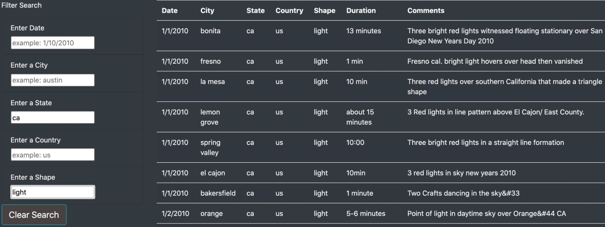

# UFOs Sightings

## Overview of the Project
The purpose of this analysis was to use JavaScript to dig up references for UFO sightings. The majority of this project was composed with Javascript, however HTML and CSS were also used. My job was to construct a place to sift through the data.js file and find similarities in UFO sighting areas. The process was quite useful in the fact that I could display a webpage, but I did think this project had some drawbacks.

## Results

To sift though the data given, I made sure to apply filters for a user to fill out to bring an interactive element to this piece. The options/inputs I allowed the user to put in were the Date, City, State, Country, and Shape. The more input you give the interface, the less likely you are to see a result. Given the fact that the dataset I received to work with this project was quite smaller, it is much more likely that if you applied all 5 filters, you may only receive one result back if that. You also have to be extremely careful on typing, because any words misspelled would result in no findings at all. Below is a snipit of my interface, where I looked a specific state and shape. The inputs can be manipulated to give you any result you are after.

## Summary

All in all, this project was a success. It was a huge accomplishment incorporating JavaScript into my tools to make an interactive figure which others could use. One drawback I noticed to using this format, was that input from the user was very unforgiving. If the user were to make a typo, the program would scan for the exact word and perhaps overlook a different form of input. For example, spelling out a state name vs. using an abbreviation. In the futre, to make this project better, I would suggest putting in a dropdown menu to add options. Instead of blindly asking the user for input which could lead to mistakes or not seeing the full scope of the project. In addition, I did not like that our data was static. To make this project more elaborate, we could add a web scraping element to constantly look for more UFO sighting data. 
